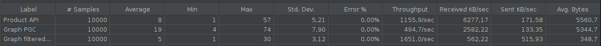

That is a result of a load test runned locally with JMeter.

Both Product API and the GraphQL application were executed by intelliJ and were reading the same dockerized mongoDB instance.

The API tested is the ProductByAdeoId and the catalogId and adeoProductId were always the same.

Tests were running one by one to avoid concurrency sharing the resource of the local machine.

- Product API: classic usage of the CPS Product by Catalog and AdeoKey
- Graph POC: requested the full message for the same product
- Graph filtered POC: requested `messageType` and `product.availableGtin.value` for the same product

The JMeter test is [here](./loadTest.jmx)